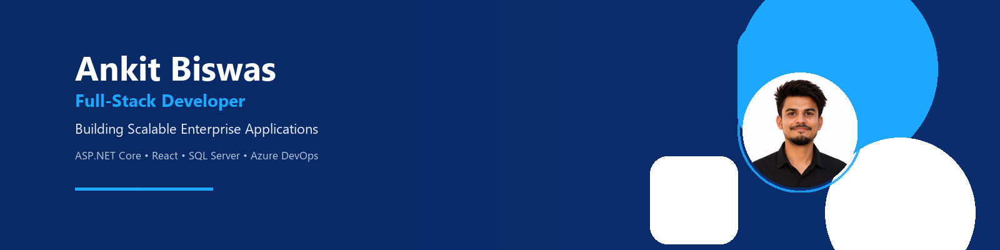

  

  

# Ankit Biswas

### Full-Stack Developer

Building scalable enterprise applications with modern Microsoft technologies.

 

  

 

---

## About Me

Full-stack developer focused on enterprise-grade web applications. Currently serving as an **IT Associate Trainee**, building production systems with **ASP.NET Core**, **React**, and **SQL Server** on **Azure** and **Azure DevOps**.

I work across the stack — from REST API design and database modeling to responsive frontends — with emphasis on **clean architecture**, **role-based security**, and **maintainable code**. This profile serves as a developer dashboard; detailed projects, certifications, and resume live on my portfolio.

---

## Current Focus

| Area | Focus |
|------|-------|
| **Enterprise Applications** | Workforce platforms, reservation systems, business workflows |
| **Cloud Computing** | Azure services, deployment pipelines, environment management |
| **Azure** | Cloud-native development and DevOps integration |
| **System Design** | Layered architecture, API contracts, data modeling |
| **Clean Architecture** | Separation of concerns, testable service layers |
| **Performance Optimization** | Query tuning, frontend efficiency, scalable APIs |

---

## Technology Stack

<table>
<tr>
<td valign="top" width="50%">

### Languages

### Frontend

### Backend

</td>
<td valign="top" width="50%">

### Database

### Cloud

### DevOps

### Tools

</td>
</tr>
</table>

---

## GitHub Analytics

 

 

### Contribution Graph

<picture>
  <source media="(prefers-color-scheme: dark)" srcset="https://raw.githubusercontent.com/Ankit2004-web/Ankit2004-web/dist/github-contribution-grid-snake-dark.svg" />
  <source media="(prefers-color-scheme: light)" srcset="https://raw.githubusercontent.com/Ankit2004-web/Ankit2004-web/dist/github-contribution-grid-snake.svg" />
  
</picture>

> The contribution snake generates automatically after the first workflow run. Trigger it manually under **Actions → Generate Snake → Run workflow**.

 

---

## Featured Projects

<table>
<tr>
<td width="50%" valign="top">

### Workforce Intelligence & Attendance Management System

Enterprise workforce platform with employee management, attendance tracking, leave workflows, analytics dashboards, role-based access control, and multilingual support.

**Stack:** `React` · `TypeScript` · `ASP.NET Core` · `SQL Server` · `JWT` · `Azure DevOps`

</td>
<td width="50%" valign="top">

### Railway Reservation Management System

Secure railway reservation platform with JWT authentication, train search, ticket booking, booking management, and an admin dashboard with role-based access.

**Stack:** `Node.js` · `Express.js` · `MongoDB` · `JavaScript` · `JWT`

</td>
</tr>
<tr>
<td colspan="2" valign="top">

### Personal Portfolio

Production portfolio showcasing projects, certifications, skills, and contact — built with a modern enterprise UI and deployed on Vercel.

**Stack:** `React` · `Tailwind CSS` · `Vercel`

</td>
</tr>
</table>

---

## Certifications

Full certification history — including AWS Academy, Palo Alto Networks Beacon, Coursera, and IBM SkillsBuild — is maintained on the portfolio.

 

---

## Development Philosophy

Software should be built to last. I prioritize clear domain boundaries, predictable APIs, and data models that reflect real business rules. Every layer — from authentication middleware to UI components — should have a defined responsibility. Performance and security are not afterthoughts; they are part of the initial design. I ship iteratively, validate with real workflows, and refine based on measurable outcomes rather than assumptions.

---

## Let's Connect

---

Building software that is reliable, scalable, and meaningful.

  

